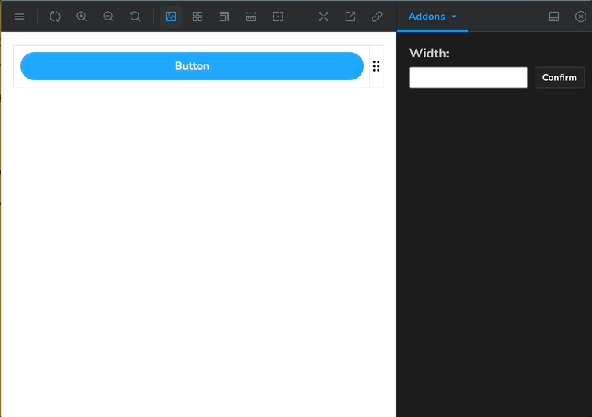

<div align="center">
  
  <h1>chessy-stories</h1>
  <span></span>
  <span></span>
</div>
<hr/>



## Table of contents

- [Introduction](#introduction)
- [Features](#features)
- [Getting Started](#getting-started)
- [Contributing](#contributing)
- [License](#license)

### Introduction

Cheesy-stories is an add-on to Storybook that provides the ability to adjust the width of any story. This makes it easy for developers to see the changes in components that occur as the width changes.

### Features

- A handle attached to a Story that can be adjusted in width with mouse actions.
- A panel that allows you to adjust the width of the Story by entering an exact number.

### Getting Started

This add-on supports Storybook version 8 and above.

```bash
npm install cheesy-stories
```

Add the following to your `.storybook/main.js`:

```javascript
const config = {
  //...
  addons: ["cheesy-stories"],
  //...
};

export default config;
```

Then, in your stories, you can use the `withCheesy` decorator to add the width adjuster.

### Contributing

Contributions are welcome! Feel free to submit a PR.

### License

MIT
